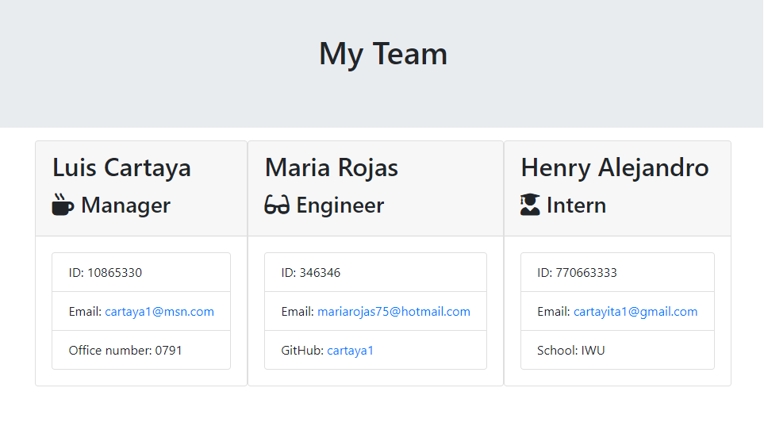
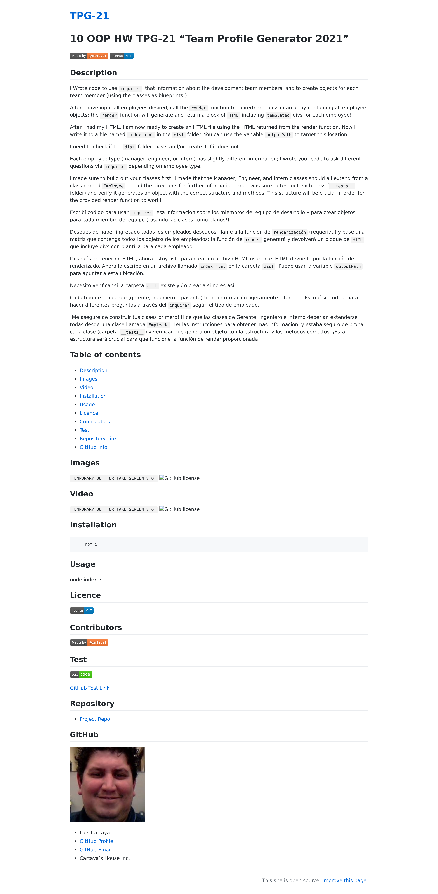

# **10 OOP HW TPG-21 "Team Profile Generator 2021"**

## Description

I Wrote code to use `inquirer`, that information about the development team members, and to create objects for each team member (using the classes as blueprints!)

After I have input all employees desired, call the `render` function (required) and pass in an array containing all employee objects; the `render` function will generate and return a block of `HTML` including `templated` divs for each employee!

After I had my HTML, I am now ready to create an HTML file using the HTML returned from the render function. Now I write it to a file named `index.html` in the `dist` folder. You can use the variable `outputPath` to target this location.

I need to check if the `dist` folder exists and/or create it if it does not.

Each employee type (manager, engineer, or intern) has slightly different information; I wrote your code to ask different questions via `inquirer` depending on employee type.

I made sure to build out your classes first! I made that the Manager, Engineer, and Intern classes should all extend from a class named `Employee`; I read the directions for further information. and I was sure to test out each class (`__tests__` folder) and verify it generates an object with the correct structure and methods. This structure will be crucial in order for the provided render function to work!

Escribí código para usar `inquirer`, esa información sobre los miembros del equipo de desarrollo y para crear objetos para cada miembro del equipo (¡usando las clases como planos!)

Después de haber ingresado todos los empleados deseados, llame a la función de `renderización` (requerida) y pase una matriz que contenga todos los objetos de los empleados; la función de `render` generará y devolverá un bloque de `HTML` que incluye divs con plantilla para cada empleado.

Después de tener mi HTML, ahora estoy listo para crear un archivo HTML usando el HTML devuelto por la función de renderizado. Ahora lo escribo en un archivo llamado `index.html` en la carpeta `dist`. Puede usar la variable `outputPath` para apuntar a esta ubicación.

Necesito verificar si la carpeta `dist` existe y / o crearla si no es así.

Cada tipo de empleado (gerente, ingeniero o pasante) tiene información ligeramente diferente; Escribí su código para hacer diferentes preguntas a través del `inquirer` según el tipo de empleado.

¡Me aseguré de construir tus clases primero! Hice que las clases de Gerente, Ingeniero e Interno deberían extenderse todas desde una clase llamada `Empleado`; Leí las instrucciones para obtener más información. y estaba seguro de probar cada clase (carpeta `__tests__`) y verificar que genera un objeto con la estructura y los métodos correctos. ¡Esta estructura será crucial para que funcione la función de render proporcionada!

## Table of contents

- [Description](#Description)
- [Images](#Images)
- [Video](#Video)
- [Installation](#Installation)
- [Usage](#Usage)
- [Licence](#Licence)
- [Contributors](#Contributors)
- [Test](#Test)
- [Repository Link](#Repository)
- [GitHub Info](#GitHub) 

## Images 

## Video

`TEMPORARY OUT FOR TAKE SCREEN SHOT`

## Installation

        npm i

## Usage

node index.js

## Licence

## Contributors

## Test

[GitHub Test Link](https://cartaya1.github.io/TPG-21/)

## Repository

- [Project Repo](https://github.com/cartaya1/RTPG-21)

## GitHub

- Luis Cartaya
- [GitHub Profile](https://github.com/cartaya1)
- [GitHub Email](cartaya1@msn.com)
- Cartaya's House Inc.